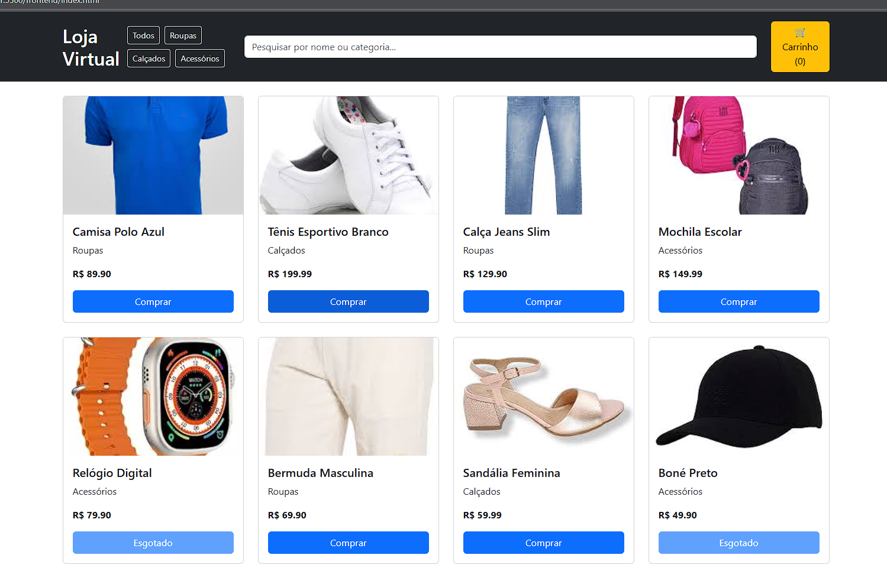
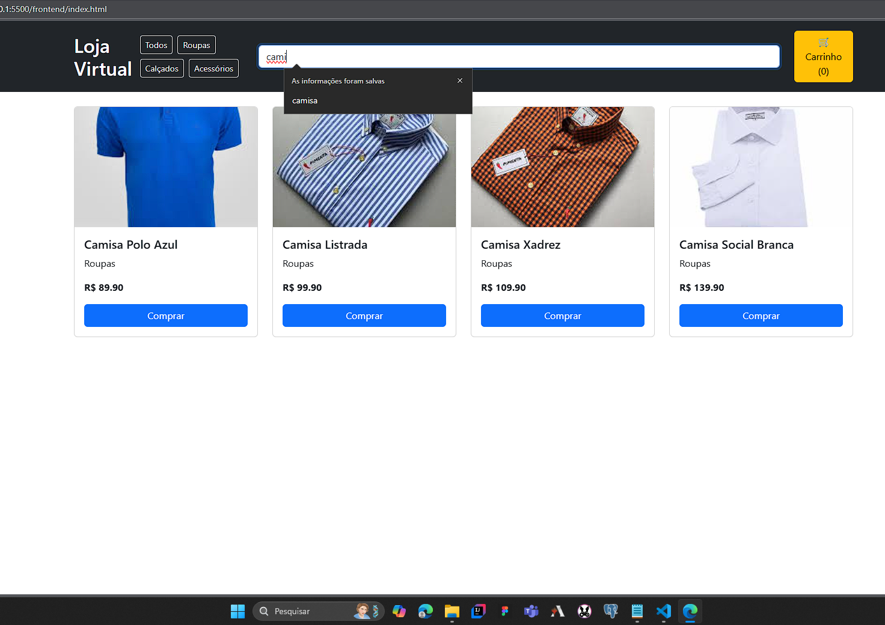
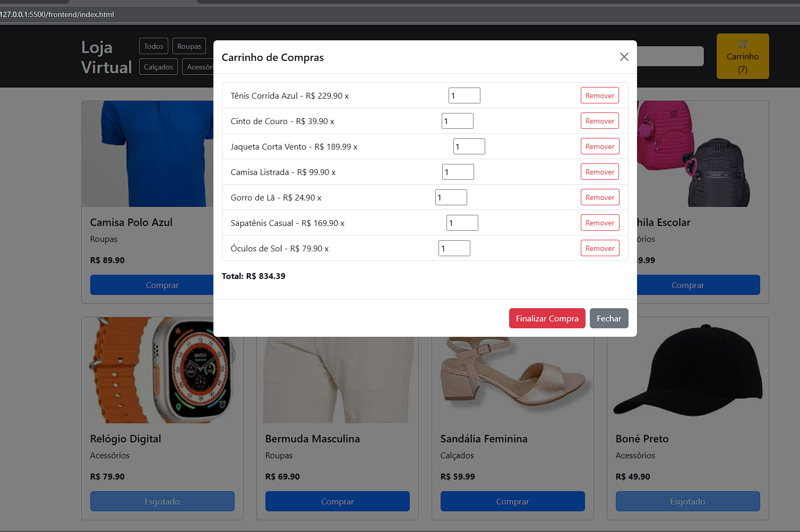
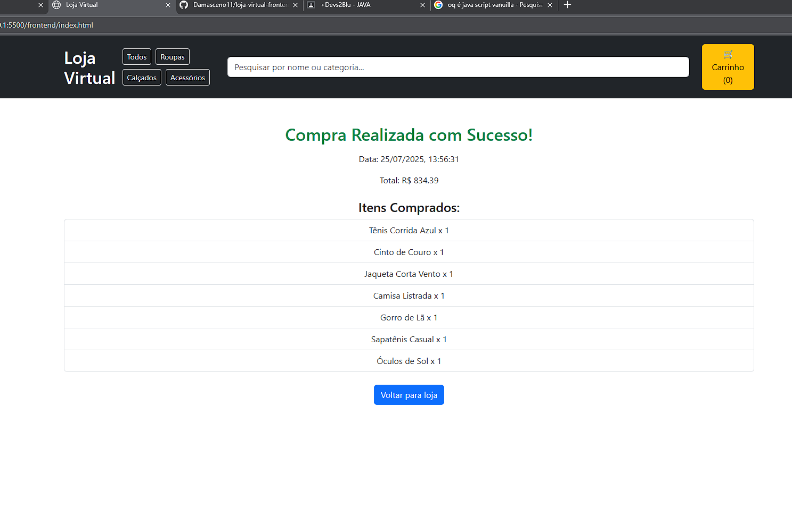
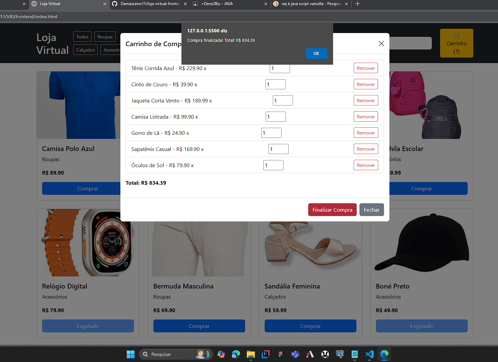

# 🛍️ Loja Virtual – Frontend + Backend (JavaScript Puro)

Este projeto é uma loja virtual completa desenvolvida com JavaScript puro, HTML, CSS e uma API Node.js (Express), atendendo a todos os critérios propostos para nota máxima no desafio prático.

## ✅ Funcionalidades

* Listagem de produtos (30 itens);
* Exibição dos produtos em formato de cards;
* Menu com categorias e busca dinâmica;
* Carrinho de compras com:

  * Adição e remoção de produtos;
  * Validação de estoque;
  * Finalização da compra;
* Alerta de produto esgotado;
* Filtro por categoria;
* Página de confirmação da compra;
* Histórico de compras (salvo no `localStorage`);
* Backend com controle de estoque simulado via frontend.

## 🚀 Tecnologias Utilizadas

* HTML5 + CSS3 (com Bootstrap 5);
* JavaScript Puro (Vanilla JS);
* Node.js com Express no Backend;
* Fetch API;
* `localStorage` para histórico de compras;
* Organização em Frontend e Backend separados.

## 🛠️ Como Executar

1. **Clone o repositório**:

   ```bash
   git clone https://github.com/seu-usuario/seu-repositorio.git
   ```

2. **Instale as dependências do backend**:

   ```bash
   cd backend
   npm install
   ```

3. **Inicie o servidor**:

   ```bash
   npm run dev
   ```

   O servidor rodará em: `http://localhost:3000/produtos`

4. **Abra o frontend com Live Server** (recomendado):

   * Navegue até a pasta `frontend`
   * Abra o `index.html` com o Live Server

> ⚠️ Atenção: O frontend consome a API local para obter os produtos. Mantenha o backend rodando.

---

## 📸 Imagens do Projeto

### 🛒 Página Inicial – Produtos



### 🔎 Filtro de Produtos por Categoria



### 🛍️ Carrinho de Compras



### ✅ Confirmação de Compra



### 📜 Histórico de Compras



---

## 👨‍💻 Autor

**Pedro Paulo Damasceno Muniz**
Estudante de Análise e Desenvolvimento de Sistemas – Uniasselvi – Blumenau
Participante do treinamento intensivo +Devs2Blu – Blumenau
🔗 GitHub: [Damasceno11](https://github.com/Damasceno11)

---

📌 Projeto com foco didático, boas práticas e separação de responsabilidades (frontend/backend) para facilitar aprendizado, manutenção e apresentação.

---
